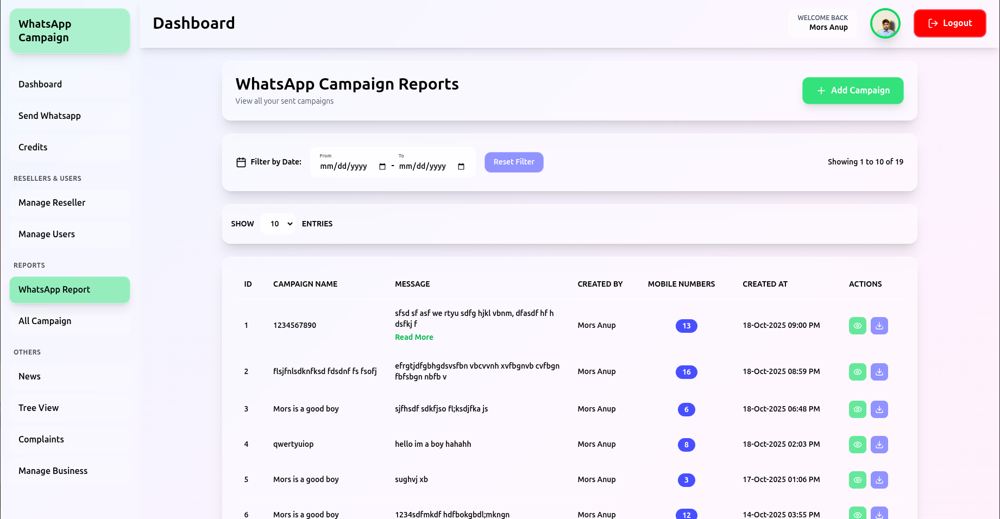
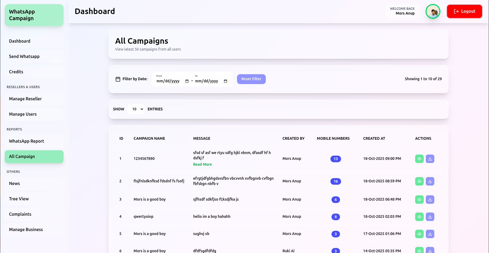
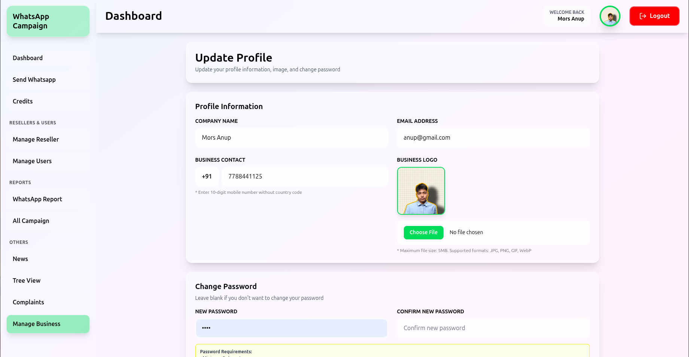

# 📱 WhatsApp Campaigner

A comprehensive full-stack WhatsApp campaign management system built with the MERN stack, featuring role-based access control, campaign management, credit systems, and real-time reporting.

[](https://whats-app-campaigner.vercel.app/)
[](https://github.com/M0rs-Ruki/WhatsApp-Campaigner)
[](LICENSE)

---

## 📑 Table of Contents

- [Features](#-features)
- [Tech Stack](#️-tech-stack)
- [Architecture](#️-architecture)
- [Prerequisites](#-prerequisites)
- [Installation](#-installation)
- [Environment Variables](#-environment-variables)
- [Running the Application](#-running-the-application)
- [Build & Deployment](#️-build--deployment)
- [Project Structure](#-project-structure)
- [API Documentation](#-api-documentation)
- [Screenshots](#-screenshots)
- [Troubleshooting](#-troubleshooting)
- [Contributing](#-contributing)
- [License](#-license)

---

## ✨ Features

### 🎯 Core Functionality

- **Campaign Management** - Create, manage, and track WhatsApp campaigns with detailed analytics
- **Credit System** - Flexible credit management for campaign operations and user balance tracking
- **Role-Based Access Control** - Three-tier system (Admin, Reseller, User) with granular permissions
- **Real-time Reports** - Comprehensive WhatsApp campaign analytics with exportable data
- **User Management** - Complete user and reseller administration dashboard
- **Complaint System** - Built-in ticketing for complaint handling and resolution
- **Business Profiles** - Account and business profile management capabilities
- **News & Reviews** - Integrated news feed and user review system

### 🔒 Technical Features

- ✅ JWT-based authentication with secure HTTP-only cookies
- ✅ File upload support with Cloudinary CDN integration
- ✅ Excel export functionality for comprehensive reports
- ✅ API rate limiting for DDoS protection
- ✅ Fully responsive UI with Tailwind CSS
- ✅ Type-safe development with TypeScript
- ✅ RESTful API architecture
- ✅ MongoDB database with Mongoose ODM
- ✅ Automated tasks with node-cron scheduler

---

## 🛠️ Tech Stack

### Frontend

| Technology | Version | Purpose |
|------------|---------|---------|
| React | 19.1.1 | UI Framework |
| TypeScript | 5.9.3 | Type Safety |
| Tailwind CSS | 4.1.14 | Styling |
| React Router DOM | 7.9.4 | Routing |
| Recharts | 3.2.1 | Data Visualization |
| React Quill | 3.6.0 | Rich Text Editor |
| Lucide React | 0.545.0 | Icons |
| Vite | Latest | Build Tool |
| date-fns | 4.1.0 | Date Utilities |
| jwt-decode | 4.0.0 | JWT Handling |

### Backend

| Technology | Version | Purpose |
|------------|---------|---------|
| Node.js | 20.15.0 | Runtime |
| Express | 5.1.0 | Web Framework |
| TypeScript | 5.9.3 | Type Safety |
| MongoDB | Latest | Database |
| Mongoose | 8.19.0 | ODM |
| jsonwebtoken | 9.0.2 | Authentication |
| bcrypt | 6.0.0 | Password Hashing |
| Multer | 2.0.2 | File Upload |
| Cloudinary | 2.7.0 | Cloud Storage |
| ExcelJS | 4.4.0 | Excel Generation |
| node-cron | 4.2.1 | Task Scheduling |
| express-rate-limit | 8.1.0 | Rate Limiting |

---

## 🏗️ Architecture

```
┌─────────────────────────────────────────────────────────────┐
│                       CLIENT LAYER                           │
│         (React + TypeScript + Tailwind CSS)                  │
│                   Hosted on Vercel                           │
└────────────────────┬────────────────────────────────────────┘
                     │
                     │ HTTPS/REST API
                     │
┌────────────────────▼────────────────────────────────────────┐
│                   API GATEWAY LAYER                          │
│          (Express + Rate Limiting + CORS)                    │
│                   Hosted on Render                           │
└────────────────────┬────────────────────────────────────────┘
                     │
        ┌────────────┼────────────┐
        │            │            │
┌───────▼──────┐ ┌──▼─────────┐ ┌▼──────────────┐
│ Auth Service │ │  Campaign  │ │ File Service  │
│ (JWT/bcrypt) │ │  Service   │ │ (Cloudinary)  │
└──────────────┘ └────────────┘ └───────────────┘
                     │
┌────────────────────▼────────────────────────────────────────┐
│                     DATABASE LAYER                           │
│                (MongoDB + Mongoose)                          │
└─────────────────────────────────────────────────────────────┘
```

### Database Schema

**Collections:**
- `users` - User accounts with role-based permissions
- `campaigns` - WhatsApp campaign data and metadata
- `complaints` - Support tickets and resolutions
- `transactions` - Credit transactions and history
- `news` - Platform announcements
- `reviews` - User feedback and ratings

---

## 📋 Prerequisites

Ensure you have the following installed before proceeding:

### Required Software

```bash
# Node.js (v20.15.0 or higher, but below v21.0.0)
node --version  # Should output v20.x.x

# npm (v9.0.0 or higher)
npm --version

# MongoDB (v6.0 or higher - local or Atlas)
mongod --version

# Git
git --version
```

### Recommended Tools

- **Code Editor**: VS Code with ESLint and TypeScript extensions
- **API Testing**: Postman or Thunder Client
- **Database GUI**: MongoDB Compass
- **Terminal**: iTerm2 (Mac) or Windows Terminal or GNOME Terminal (Linux)

---

## 🚀 Installation

### Step 1: Clone the Repository

```bash
git clone https://github.com/M0rs-Ruki/WhatsApp-Campaigner.git
cd WhatsApp-Campaigner
```

### Step 2: Backend Setup

```bash
# Navigate to backend directory
cd backend

# Install dependencies
npm install

# Create environment file
cp .env.example .env
# Edit .env with your configuration
```

### Step 3: Frontend Setup

```bash
# Navigate to frontend directory (from root)
cd ../frontend

# Install dependencies
npm install

# Create environment file
cp .env.example .env
# Edit .env with your configuration
```

### Step 4: Database Setup

**Option A: Local MongoDB**
```bash
# Start MongoDB service
sudo systemctl start mongod  # Linux
brew services start mongodb-community  # Mac
```

**Option B: MongoDB Atlas**
1. Create account at [MongoDB Atlas](https://www.mongodb.com/cloud/atlas)
2. Create a new cluster
3. Get connection string
4. Add to backend `.env` as `MONGODB_URI`

---

## 🔐 Environment Variables

### Backend Configuration

Create `backend/.env`:

```env
# Server Configuration
PORT=8080
CORS_ORIGIN=http://localhost:5173

# Database
MONGO_URI=mongodb://localhost:27017/whatsapp-campaigner
DB_NAME=whatsapp-campaigner


# JWT Configuration
JWT_SECRET=your_super_secret_jwt_key_here_minimum_32_characters_long
JWT_EXPIRE=7d

# Cloudinary Configuration
CLOUDINARY_CLOUD_NAME=your_cloudinary_cloud_name
CLOUDINARY_API_KEY=your_cloudinary_api_key
CLOUDINARY_API_SECRET=your_cloudinary_api_secret

# Cloudinary
CLOUDINARY_URL=cloudinary://<ApiKey>:<SecretKey>@<CloudName>
CLOUDINARY_CLOUD_NAME=your_cloudinary_cloud_name
CLOUDINARY_API_KEY=your_cloudinary_api_key
CLOUDINARY_API_SECRET=your_cloudinary_api_secret

# Rate Limiting
RATE_LIMIT_WINDOW_MS=15 * 50 * 1000
RATE_LIMIT_MAX_REQUESTS=127

```

### Frontend Configuration

Create `frontend/.env`:

```env
# API Configuration
VITE_API_URL=http://localhost:8080
```

---

## 💻 Running the Application

### Development Mode

#### Option 1: Run Separately (Recommended)

**Terminal 1 - Backend:**
```bash
cd backend
npm run dev
# Server starts at http://localhost:8080
```

**Terminal 2 - Frontend:**
```bash
cd frontend
npm run dev
# Application starts at http://localhost:5173
```

#### Option 2: Run Concurrently

Create `package.json` in root:

```json
{
  "scripts": {
    "dev": "concurrently \"cd backend && npm run dev\" \"cd frontend && npm run dev\"",
    "install-all": "cd backend && npm install && cd ../frontend && npm install"
  },
  "devDependencies": {
    "concurrently": "^8.0.0"
  }
}
```

Then run:
```bash
npm install
npm run dev
```

### Accessing the Application

- **Frontend**: http://localhost:5173
- **Backend API**: http://localhost:8080

---

## 🏗️ Build & Deployment

### Building for Production

#### Backend Build

```bash
cd backend

# Clean previous build
npm run clean

# Compile TypeScript to JavaScript
npm run build

# Test production build locally
npm start
```

#### Frontend Build

```bash
cd frontend

# Run linter
npm run lint

# Build for production
npm run build

# Preview production build
npm run preview
```

---

## 🌐 Deployment Guide

### Backend Deployment (Render)

1. **Create Web Service**
   - Go to [Render Dashboard](https://dashboard.render.com/)
   - Click "New +" → "Web Service"
   - Connect GitHub repository

2. **Configure Settings**
   ```
   Build Command: cd backend && npm install && npm run build
   Start Command: cd backend && npm start
   ```

3. **Environment Variables**
   - Add all variables from backend `.env`
   - Set `NODE_ENV=production`
   - Update `FRONTEND_URL` to Vercel domain

4. **Deploy**
   - Auto-deploys on push to main
   - Note your URL: `https://your-app.onrender.com`

### Frontend Deployment (Vercel)

1. **Via Vercel Dashboard**
   - Go to [Vercel](https://vercel.com/dashboard)
   - Import GitHub repository
   - Configure:
     ```
     Framework: Vite
     Root Directory: frontend
     Build Command: npm run build
     Output Directory: dist
     ```

2. **Environment Variables**
   - Add frontend `.env` variables
   - Update `VITE_API_URL` to Render backend URL

3. **Deploy**
   - Click "Deploy"
   - Live at `https://your-app.vercel.app`

**OR via CLI:**
```bash
cd frontend
vercel --prod
```

### Post-Deployment Checklist

- [ ] Update CORS settings with production URLs
- [ ] Test authentication flow
- [ ] Verify database connections
- [ ] Check API endpoints
- [ ] Monitor error logs
- [ ] Test file uploads
- [ ] Verify email notifications (if any)

---

## 📁 Project Structure

```
WhatsApp-Campaigner/
├── backend/
│   ├── src/
│   │   ├── app.ts                    # Application entry point
│   │   ├── config/
│   │   │   ├── db.ts                 # Database configuration
│   │   │   └── cloudinary.ts         # Cloudinary setup
│   │   ├── models/
│   │   │   ├── User.ts               # User model & schema
│   │   │   ├── Campaign.ts           # Campaign model
│   │   │   ├── Complaint.ts          # Complaint model
│   │   │   ├── Transaction.ts        # Transaction model
│   │   │   └── Business.ts           # Business model
│   │   ├── controllers/
│   │   │   ├── authController.ts     # Authentication logic
│   │   │   ├── campaignController.ts # Campaign CRUD
│   │   │   ├── userController.ts     # User management
│   │   │   ├── complaintController.ts# Complaint handling
│   │   │   └── dashboardController.ts# Dashboard data
│   │   ├── routes/
│   │   │   ├── authRoutes.ts         # Auth endpoints
│   │   │   ├── campaignRoutes.ts     # Campaign endpoints
│   │   │   ├── userRoutes.ts         # User endpoints
│   │   │   └── complaintRoutes.ts    # Complaint endpoints
│   │   ├── middleware/
│   │   │   ├── auth.ts               # JWT verification
│   │   │   ├── roleCheck.ts          # Role-based access
│   │   │   └── errorHandler.ts       # Global error handler
│   │   └── utils/
│   │       ├── generateToken.ts      # JWT generation
│   │       └── validators.ts         # Input validation
│   ├── dist/                         # Compiled output
│   ├── package.json
│   ├── tsconfig.json
│   └── .env
│
├── frontend/
│   ├── src/
│   │   ├── main.tsx                  # App entry point
│   │   ├── App.tsx                   # Root component
│   │   ├── pages/
│   │   │   ├── Dashboard.tsx         # Main dashboard
│   │   │   ├── SendWhatsApp.tsx      # Campaign creation
│   │   │   ├── Credit.tsx            # Credit management
│   │   │   ├── ManageReseller.tsx    # Reseller admin
│   │   │   ├── ManageUser.tsx        # User admin
│   │   │   ├── WhatsAppReport.tsx    # Campaign reports
│   │   │   ├── AllCampaign.tsx       # Campaign list
│   │   │   ├── News.tsx              # News feed
│   │   │   ├── Review.tsx            # Reviews page
│   │   │   ├── Complaints.tsx        # Complaints system
│   │   │   └── ManageBusiness.tsx    # Business settings
│   │   ├── components/
│   │   │   ├── Navbar.tsx            # Top navigation
│   │   │   ├── Sidebar.tsx           # Side navigation
│   │   │   ├── ProtectedRoute.tsx    # Auth guard
│   │   │   └── common/               # Reusable components
│   │   ├── context/
│   │   │   └── AuthContext.tsx       # Auth state management
│   │   ├── hooks/
│   │   │   └── useAuth.ts            # Auth custom hook
│   │   ├── services/
│   │   │   └── api.ts                # API client
│   │   ├── types/
│   │   │   └── index.ts              # TypeScript definitions
│   │   └── styles/
│   │       └── index.css             # Global styles
│   ├── public/                       # Static assets
│   ├── dist/                         # Production build
│   ├── package.json
│   ├── tsconfig.json
│   ├── vite.config.ts
│   ├── tailwind.config.js
│   └── .env
│
├── screenshots/                      # Application screenshots
├── README.md
├── LICENSE
└── .gitignore
```

---

## 📡 API Documentation

### Authentication Endpoints

```
POST   /api/auth/login           User login
POST   /api/auth/logout          User logout
GET    /api/auth/profile         Get user profile
PUT    /api/auth/profile         Update user profile
```

### Campaign Endpoints

```
GET    /api/campaigns            Get all campaigns
POST   /api/campaigns            Create new campaign
GET    /api/campaigns/:id        Get campaign by ID
PUT    /api/campaigns/:id        Update campaign
DELETE /api/campaigns/:id        Delete campaign
GET    /api/campaigns/reports    Get campaign reports
```

### User Management Endpoints

```
GET    /api/users                Get all users (Admin)
GET    /api/users/:id            Get user by ID
PUT    /api/users/:id            Update user
DELETE /api/users/:id            Delete user
POST   /api/users/credits        Add credits
```

### Complaint Endpoints

```
GET    /api/complaints           Get all complaints
POST   /api/complaints           Create complaint
PUT    /api/complaints/:id       Update complaint status
GET    /api/complaints/:id       Get complaint details
```

---

## 📸 Screenshots

### Dashboard

*Main dashboard with campaign analytics and statistics*

### Send WhatsApp Campaign

*Create and send WhatsApp campaigns to targeted users*

### Credit Management

*Manage user credits and transaction history*

### Manage Reseller

*Admin panel for reseller management and oversight*

### Manage User

*User management dashboard with role assignments*

### WhatsApp Report

*Detailed campaign reports with delivery status and analytics*

### All Campaigns

*View all campaigns with filtering and sorting options*

### News

*Platform news and announcements feed*

### Tree View

*User can see there created User and Reseller in tree view*

### Complaints

*Complaint tracking and resolution system*

### Manage Business

*Business profile and account settings management*

---

## 🔧 Troubleshooting

### Common Issues & Solutions

#### MongoDB Connection Error
```
Error: connect ECONNREFUSED 127.0.0.1:27017
```
**Solution:**
```bash
# Check if MongoDB is running
sudo systemctl status mongod

# Start MongoDB
sudo systemctl start mongod
```

#### Port Already in Use
```
Error: listen EADDRINUSE: address already in use :::8080
```
**Solution:**
```bash
# Find and kill process
lsof -i :8080
kill -9 <PID>

# Or use different port in .env
PORT=8081
```

#### TypeScript Compilation Errors
```bash
# Clear cache and reinstall
rm -rf node_modules package-lock.json
npm install

# Rebuild
rm -rf dist
npm run build
```

#### CORS Errors
- Verify `FRONTEND_URL` in backend `.env`
- Check CORS middleware allows your origin
- Ensure `credentials: true` in frontend API calls

#### Environment Variables Not Loading
- Restart dev server after changing `.env`
- Check variable names (case-sensitive)
- Verify `.env` file location
- Don't commit `.env` to version control

---

## 🧪 Testing

### Manual Testing

```bash
# Backend health check
curl http://localhost:8080/api/health

# Test authentication
curl -X POST http://localhost:8080/api/auth/login \
  -H "Content-Type: application/json" \
  -d '{"email":"test@example.com","password":"password123"}'
```

### Type Checking

```bash
# Frontend
cd frontend
npx tsc --noEmit

# Backend
cd backend
npx tsc --noEmit
```

---

## 🤝 Contributing

We welcome contributions! Please follow these guidelines:

### How to Contribute

1. **Fork the repository**
2. **Create a feature branch**
   ```bash
   git checkout -b feature/amazing-feature
   ```
3. **Commit your changes**
   ```bash
   git commit -m "Add: amazing new feature"
   ```
4. **Push to branch**
   ```bash
   git push origin feature/amazing-feature
   ```
5. **Open a Pull Request**

### Code Style Guidelines

- ✅ Use TypeScript for all code
- ✅ Follow ESLint configuration
- ✅ Write meaningful commit messages
- ✅ Add comments for complex logic
- ✅ Keep components small and focused
- ✅ Write unit tests for new features

### Commit Message Format

```
Type: Brief description

Types: Add, Update, Fix, Remove, Refactor, Docs, Style, Test
```

---

## 📄 License

This project is licensed under the ProMinds Digital (formerly Prolific IDEAS) License - see the [LICENSE](LICENSE) file for details.

---

## 🏢 Created By

### ProMinds Digital
**Formerly Prolific IDEAS**

*Digital Marketing & IT Solutions Company*

ProMinds Digital is a leading brand-driven performance marketing company that specializes in delivering comprehensive digital marketing and technology solutions. With expertise in Digital Marketing, WhatsApp Marketing, SEO, and cutting-edge web/app development, ProMinds empowers businesses to enhance their online presence and drive sustainable growth.

#### 🎯 Core Services
- 📱 Digital Marketing
- 💬 WhatsApp Marketing
- 🔍 SEO Services
- 🌐 Web Development
- 📲 App Development
- 📊 Performance Marketing

#### 🌐 Connect with ProMinds Digital
- **Website**: [prominds.digital](https://prominds.digital)
- **Legacy Site**: [prolificideas.in](https://prolificideas.in)
- **Facebook**: [Follow for updates](https://facebook.com/promindsdigital)
- **WhatsApp**: [Marketing Expert](https://wa.me/your-number)

---

## 👨‍💻 Author

**Anup Pradhan (M0rs)**

- GitHub: [@M0rs-Ruki](https://github.com/M0rs-Ruki)
- Project: [WhatsApp Campaigner](https://github.com/M0rs-Ruki/WhatsApp-Campaigner)
- Live Demo: [whats-app-campaigner.vercel.app](https://whats-app-campaigner.vercel.app/)

---

## 🙏 Acknowledgments

- React Team for the powerful UI framework
- MongoDB for the flexible database solution
- Vercel and Render for excellent hosting services
- Open source community for amazing libraries
- All contributors and users of this project

---

## 📞 Support

Need help? Here's how to get support:

- 📖 Check the [Documentation](#-table-of-contents)
- 🐛 [Open an Issue](https://github.com/M0rs-Ruki/WhatsApp-Campaigner/issues)
- 💬 Use the in-app support page
- 📧 Contact the development team

---

## 🗺️ Roadmap

### Upcoming Features

- [ ] Email notifications for campaigns
- [ ] Multi-language support
- [ ] Advanced analytics dashboard
- [ ] Bulk operations for campaigns
- [ ] API rate limiting per user
- [ ] Two-factor authentication
- [ ] Mobile app (React Native)
- [ ] Webhook integrations

---

## 📊 Project Stats


---

**Made with ❤️ by M0rs-Ruki**

*Last Updated: October 2025*